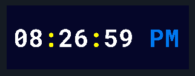

# Desktop Clock

A minimalist desktop clock application built with Zig and RayLib featuring borderless transparency, auto-scaling fonts, and persistent window configuration.

## Features

- **Borderless & Transparent Mode**: Click anywhere on the clock to toggle between bordered and borderless window modes
- **Auto-scaling Display**: Font automatically scales to fit the window size as you resize
- **Multi-monitor Support**: Remembers which monitor the clock was on
- **Persistent Configuration**: Window position, size, monitor, and border state are automatically saved
- **Color-coded Time Display**: Hours/minutes/seconds in white, colons in yellow, AM/PM in blue
- **Always on Top**: Clock stays visible above other windows

## Screenshots



## Building

Requires Zig 0.16 or later.

```bash
# Build the project
zig build

# Run the clock
zig build run

# Run tests
zig build test
```

The executable will be created at `bin/clock` with assets in `bin/assets/`.

## Usage

- **Left Click**: Toggle window border on/off
- **Resize Window**: Font automatically scales to fit
- **Drag**: Move window to any position
- **Close**: Standard window close button (or Alt+F4)

Configuration is automatically saved to `clock.json` in the executable directory.

## Technical Stack

- **Language**: Zig 0.16
- **Graphics**: RayLib (via raylib_zig)
- **Font**: RobotoMono Nerd Font Bold
- **Architecture**: Manager-based pattern (screenManager, configManager, fontManager, displayManager, pathManager)

## Configuration

The `clock.json` file stores:
- Window dimensions (width, height)
- Window position (x, y)
- Monitor index
- Border state (true/false)

On first run, the clock will center itself on the primary monitor with default dimensions (300x100).

## License

This project is licensed under the Creative Commons Attribution 4.0 International License - see the LICENSE file for details.
